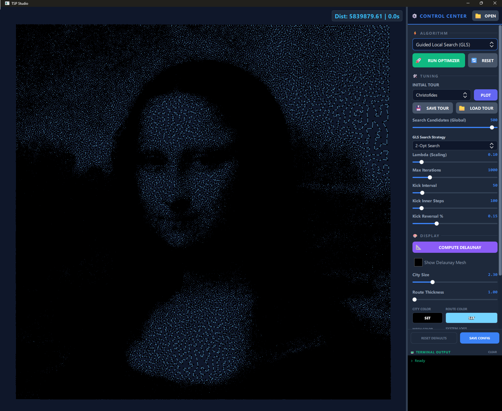

# TSP Studio



A high-performance, visually-premium Traveling Salesperson Problem (TSP) optimization suite built with **C++17** and **Qt Quick / QML**.

[](https://opensource.org/licenses/MIT)
[](https://en.wikipedia.org/wiki/C%2B%2B17)
[](https://www.qt.io/)

---

## 🚀 Key Features

- **High-Performance Core**: Multi-threaded solver architecture optimized for large-scale optimization.
- **Rich Visualization Engine**: Real-time rendering of tour evolution with a modern "Industrial" aesthetic and smooth animations.
- **Interactive Map Utility**:
    - **Add/Remove Cities**: Intuitive double-click interaction to build custom problem sets.
    - **Repositioning**: Smoothly drag cities to see the solvers re-evaluate in real-time.
- **Pro Performance Feedback**:
    - Live **Terminal Log** showing iteration progress, convergence metrics, and performance tracers.
    - Status dashboard with best-found distance and current execution time.
- **Customizable Experience**: Fully customizable UI colors via a professional integrated color picker.

---

## 🎮 Interface & Control Center

The application features a sleek, glassmorphic Control Center on the right, organized logically from top to bottom for a professional workflow:

### 1. Algorithm & Strategy Suite (Top)
*   **Main Algorithm Selector**: A comprehensive dropdown to choose your optimization engine (e.g., Genetic Algorithm, Tabu Search, LK).
*   **Dynamics Configuration**: Context-aware parameters that automatically adjust to show relevant sliders (e.g., *Cuckoo Step-Size*, *Population Size*, or *LK Search Candidates*).
*   **Initialization Method**: Select how the starting tour is constructed (Christofides, Nearest Neighbor, Delaunay-heuristic).

### 2. Execution Commands (Middle)
*   **🚀 Generate Tour**: Starts the high-intensity optimization loop.
*   **📊 Plot Initial Solution**: Quickly visualizes the pre-optimization state.
*   **🔄 Reset TSP Studio**: Purges current state for a clean slate.
*   **🛑 Stop Solver**: Immediately terminates the background worker thread.

### 3. Problem Management & Map Ops (Bottom)
*   **File Controls**: Dedicated buttons to **Load TSP** (TSPLIB format) and **Save Tour**.
*   **Spatial Transformations**: Buttons to **Rotate** (90° increments) or **Flip** the map horizontally/vertically.
*   **Visual Parameters**: Control the aesthetic depth with sliders for **City Size**, **Path Thickness**, and **Clear Map**.
*   **Appearance**: A premium color selection tray to customize the City, Route, and Delaunay colors.
*   **Metrics Dashboard**: Real-time display of the *Best Distance* and *Elapsed Time* in milliseconds.

---

## 🧠 Optimization Suite (Metaheuristics)

TSP Studio features a best-in-class multi-variant execution engine. Every heuristic is implementation-depth optimized using high-performance candidate lists.

### Elite Solvers
*   **Lin-Kernighan Algorithm (LK)**: High-performance search for near-optimal results.
*   **Genetic Algorithm (GA)**: Memetic GA featuring **Edge Assembly Crossover (EAX)**, OX, and 5 population variants:
    *   Standard, Island Model, Cellular Grid, ALPS (Age-Layered), and EAX-Steady State.
*   **Cuckoo Search (CS)**: 5 premium variations:
    *   Standard, Adaptive Step-Size, Chaotic Fractal Flights (CF-CS), Cellular, and Elitist Replacement.
*   **Gray Wolf Optimization (GWO)**: 5 leadership variants:
    *   Standard, Hierarchical (H-GWO), Non-Linear Parameter, Enhanced Exploration, and Multi-Leader.
*   **Whale Optimization Algorithm (WOA)**: 5 hunting strategies:
    *   Standard, Levy Flight, Adaptive Weight, Chaotic Bubble-Net, and Oppositional Based.
*   **Pelican Optimization Algorithm (POA)**: 5 phases:
    *   Standard, Phase-Adaptive, Chaotic Swarm, and Oppositional Search.
*   **Ecological Cycle TSP Studio (ECO)**: Novel cyclic population-based search.

### High-Power Local Search
*   **Guided Local Search (GLS)**: Meta-strategy using edge penalties to escape local optima.
*   **Iterated Local Search (ILS)**: Advanced kick-and-refine cycles with multiple search strategies.
*   **Tabu Search (TS)**: Premium search with dynamic tenure management, aspiration criteria, and diversification kicks.
*   **k-Opt Family**: Professional-grade **2-Opt**, **3-Opt**, and **5-Opt** implementations.

---

## 🛠️ Performance & Architecture

- **Candidate List Support**: O(N) neighborhood efficiency using smart neighbor lists for ultra-fast exploration.
- **Parallel Execution**: Leverages `OpenMP` for population-based metaheuristics (where applicable).
- **Tracer Diagnostics**: High-resolution performance tracing integrated into the solver worker.

---

## ⚖️ License & Open Source

This project is licensed under the **MIT License**. See the [LICENSE](LICENSE) file for details.

### Third-Party Attribution
TSP Studio utilizes the following open-source technologies:
- **Qt6**: Graphics and application framework.
- **CDT**: Constrained Delaunay Triangulation engine (MPL 2.0).
- **Geometric Predicates**: Robust predicates (BSD 3-Clause).

Refer to [THIRD-PARTY.md](THIRD-PARTY.md) for full license details of these components.

---

## 👤 Credits

**Mohamed Elkeran**
* Algorithm Design & Optimization.

---

## ⚡ Quick Start

1.  **Build**: Open `CMakeLists.txt` in Qt Creator or build via CLI:
    ```bash
    mkdir build && cd build
    cmake ..
    cmake --build .
    ```
2.  **Optimize**: Drag and drop cities or import a `.tsp` file to start the engine.
